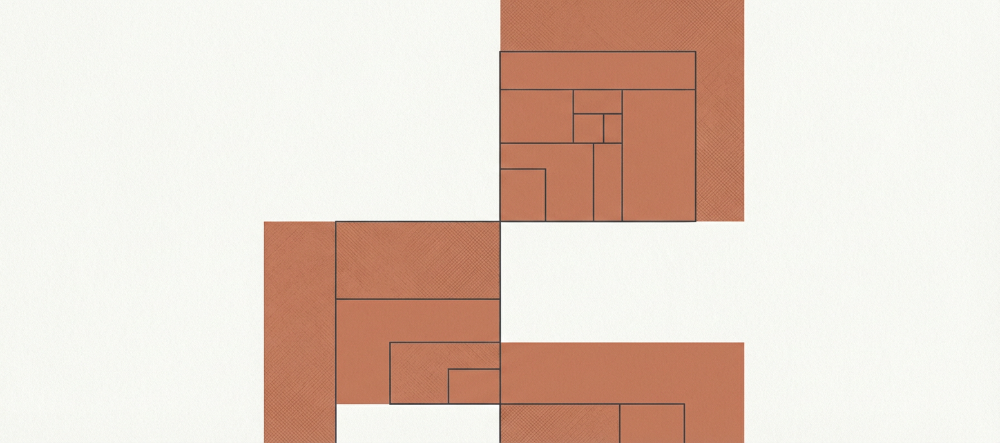

<p align="center">
  
</p>

<h1 align="center">
  
  obsidian-better-toc
</h1>

<p align="center">
  <strong>Generate elegant table of contents for Obsidian notes</strong><br>
  <sub>Obsidian Plugin</sub>
</p>

---

## Features

| Command                                         | Description                              |
| ----------------------------------------------- | ---------------------------------------- |
| Create full table of contents                   | Generate TOC for all subheadings         |
| Create table of contents for next heading level | Generate TOC scoped to immediate sublevel |

| Setting              | Type                 | Default     |
| -------------------- | -------------------- | ----------- |
| List Style           | `bullet` or `number` | `bullet`    |
| Format Style         | `plain`, `markdown`, `wiki` | `markdown` |
| Title                | string               | (none)      |
| Minimum header depth | 1-6                  | 2           |
| Maximum header depth | 1-6                  | 6           |
| GitHub Compatibility | boolean              | false       |

## Demo


## Usage

The TOC is **scoped**: it only includes headings under the current heading until the next same-level heading.

**Example:**

_Input:_ Run "Table of Contents" under a level 2 heading
_Output:_ TOC contains only subheadings of that level 2 heading

### Recommended Hotkeys

- `CMD + SHIFT + T` → Create full table of contents
- `CMD + T` → Create table of contents for next heading level

## Installation

Install from Obsidian Community Plugins, or manually:

1. Download latest release
2. Extract to `<vault>/.obsidian/plugins/obsidian-better-toc/`
3. Enable "Table of Contents" in Settings → Community Plugins

## Customization

### Nested Numbered Lists

Add this CSS snippet for nested list counting (1.1, 1.2):

```css
ol {
  counter-reset: item;
}

ol li {
  display: block;
}

ol li:before {
  content: counters(item, ".") ". ";
  counter-increment: item;
  padding-right: 5px;
}
```

Enable in Settings → Appearance → CSS Snippets.

## Development

```bash
pnpm install    # Install dependencies
pnpm dev        # Development with watch mode
pnpm build      # Production build
```

## Tech Stack

- TypeScript
- Obsidian API
- esbuild
- anchor-markdown-header (GitHub link compatibility)

## License

MIT
